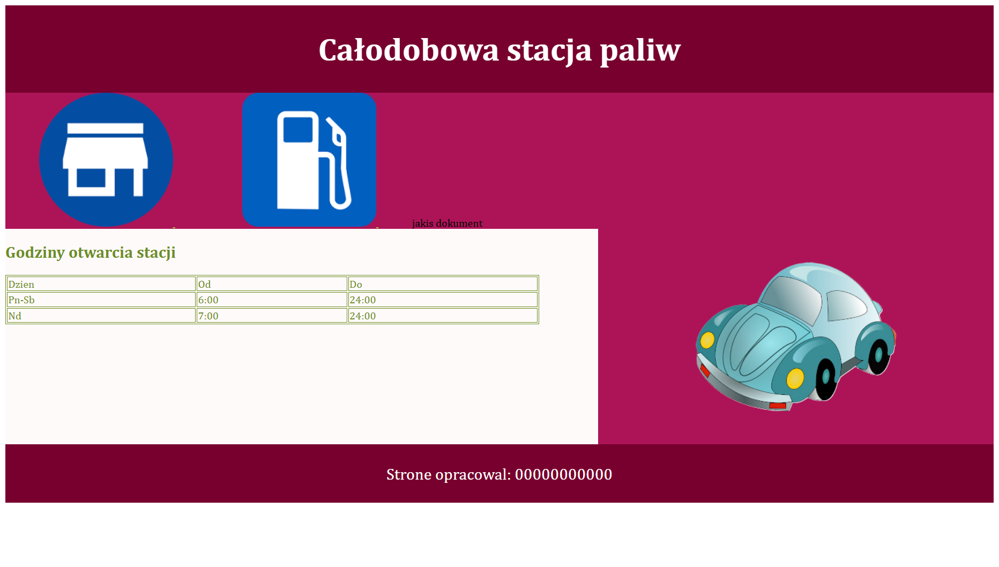

# Egzamin E.14 (01.19)

**Temat:** Tworzenie aplikacji internetowej zgodnie z wymaganiami egzaminacyjnymi kwalifikacji E.14.  
**Data:** Styczeń 2019, wersja 01

## 📁 Struktura
- `stacja.html` – kod strony
- `obliczenia.html` - kod podstrony
- `styl.css` – style CSS
- `grafika/` – grafiki do strony

## 🧩 Wymagania
- Zgodność z treścią egzaminu INF.03
- Poprawne formatowanie i układ strony
- Grafika zgodnie z opisem zadania

## 📸 Podgląd strony

## 🏷️ Licencja
MIT

## ✍️ Autor
Bambikos • [GitHub](https://github.com/Bambikos)
